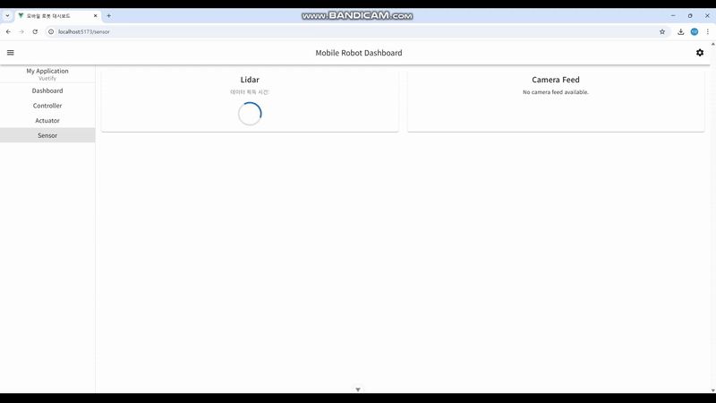
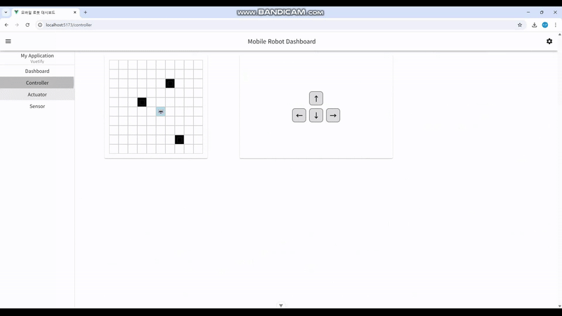

# Mobile Robot Dashboard

## 프로젝트 개요

Mobile Robot Dashboard는 Vue와 Vuetify를 활용하여 제작된 웹 대시보드로, 모바일 로봇의 센서 및 제어 데이터를 시각화하는 역할을 합니다. server와 client 간의 통신은 WebSocket을 사용하며, 실시간으로 데이터를 송수신하여 차트와 컨트롤 UI를 업데이트합니다.

## 기술 스택

- **Frontend:** Vue.js, Vuetify, Chart.js, Pinia
- **Backend:** Node.js, WebSocket, TCP Socket
- **Embedded:** Raspberry Pi, Camera Sensor

## 프로젝트 구조

```
MobileRobotDashboard
| - client               # 샘플 데이터 생성 및 TCP 소켓을 통해 서버로 전송
| - server               # TCP 소켓 데이터 수신 후 WebSocket으로 broadcast
| - vuetify-client       # 웹 대시보드 (Vue + Vuetify)
|  | - node_modules
|  | - public
|  | - src
|  |  | - components
|  |  |  | - Actuator    # 액추에이터 관련 UI 컴포넌트
|  |  |  |  | - MotorAngleLineChartCard.vue
|  |  |  |  | - MotorCard.vue
|  |  |  |  | - MotorCurrentLineChartCard.vue
|  |  |  |  | - MotorSpeedLineChartCard.vue
|  |  |  |  | - MotorTemperatureLineChartCard.vue
|  |  |  |  | - MotorTorqueLineChartCard.vue
|  |  |  | - Controller  # 컨트롤러 관련 UI 컴포넌트
|  |  |  |  | - KeyboardCard.vue
|  |  |  |  | - RobotMapCard.vue
|  |  |  | - Dashboard   # 대시보드 UI
|  |  |  |  | - ConnectionCard.vue
|  |  |  |  | - DashboardCard.vue
|  |  |  | - Sensor      # 센서 데이터 UI
|  |  |  |  | - CameraCard.vue
|  |  |  |  | - LidarChartCard.vue
|  |  | - router
|  |  |  | - index.js    # view page router 관리
|  |  | - stores
|  |  |  | - cameraStores.js    # camera 데이터 관리
|  |  |  | - displayStores.js   # drawer 상태 관리
|  |  |  | - lidarStores.js     # lidar 데이터 관리
|  |  |  | - motorStores.js    	# motor 데이터 관리
|  |  |  | - websocketStores.js # websocket 통신 관리
|  |  | - views
|  |  |  | - Actuator.vue
|  |  |  | - Controller.vue
|  |  |  | - Dashboard.vue
|  |  |  | - Sensor.vue
|  | - App.vue
|  | - main.js
| - raspberry-client
|  | - cam_stream.py	# 카메라 센서 데이터를 TCP 소켓으로 전송
|  | - cam_test.py   	# 카메라 센서 동작 테스트
| - webcam-client
   | - webcam_stream.py	# 웹캠 센서 데이터를 TCP 소켓으로 전송
   | - webcam_test.py   # 웹캠 센서 동작 테스트
```

## 주요 기능

### 🎨 Vuetify 기반 반응형 UI

- Google의 Material Design 규칙을 준수하여 직관적인 UI 설계
- Vuetify의 Grid System과 Card 컴포넌트를 활용하여 반응형 대시보드 구현

### 📊 실시간 데이터 시각화

- WebSocket을 통해 수신한 데이터를 Chart.js를 활용하여 그래프로 표현
- Pinia를 이용해 데이터 상태를 중앙에서 관리하여 UI 업데이트 간소화

### 🔗 데이터 통신

- TCP 소켓을 이용해 client와 server 간 데이터 전송
- server는 수신한 데이터를 WebSocket을 통해 프론트엔드에 전달
- raspberry-client는 카메라 센서 데이터를 server로 전송하여 실시간 모니터링 지원

## 실행 방법

### 1. Backend (server) 실행

```powershell
cd server
npm install
node index.js
```

### 2. Frontend (vuetify-client) 실행

```powershell
cd vuetify-client
npm install
npm run dev
```

### 3. 샘플 데이터 전송 (client 실행)

```powershell
cd client
npm install
npm run dev
```

### 4-1. 센서 데이터 전송 (raspberry-client 실행)

```powershell
cd raspberry-client
python cam_stream.py
```

### 4-2. 센서 데이터 전송 (webcam-client 실행)

```powershell
cd webcam-client
python webcam_stream.py
```

## 실행화면

**서버 연결하기**



**데이터 시각화**


**반응형 웹**


**로봇 제어(Prototype)**



## 마무리

본 프로젝트는 Vue와 Vuetify를 활용한 대시보드 개발의 예제로, 실시간 데이터 시각화 및 반응형 UI 설계를 효과적으로 구현하였습니다. 추가 기능 개발이나 개선 사항이 있다면 자유롭게 기여해 주세요!